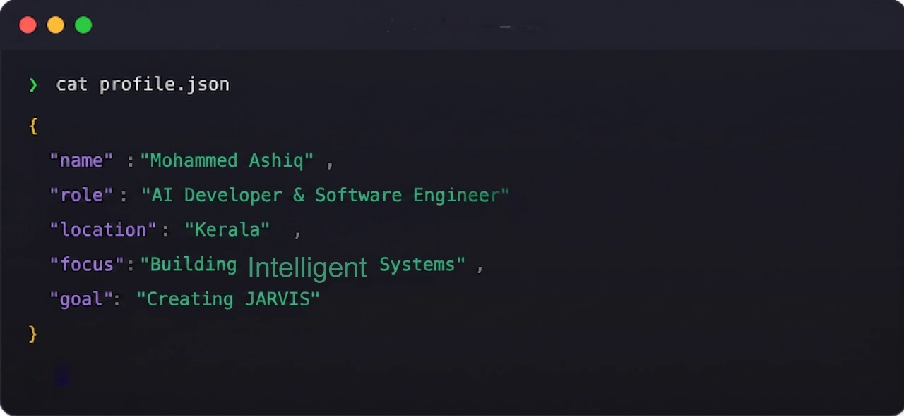

<!-- introduction -->
<h1 align="center">
  
</h1>

 
<!-- ═══════════════════════════════════════════════════════════════════════════ -->
<!-- 🖥️ TERMINAL INTRO SECTION                                                   -->
<!-- ═══════════════════════════════════════════════════════════════════════════ -->

  

 

 

<!-- social handles -->

 
  <!-- gmail -->
  
  <!-- linkedin -->
   

<!-- skills -->
<h2 align="center">🔥 Languages-Frameworks-Tools 🔥</h2>
 

  <a href="https://skillicons.dev">
      <!-- first row -->
      <picture>
          <source media="(prefers-color-scheme: dark)" srcset="https://skillicons.dev/icons?i=nextjs%2Creact%2Cgit%2Chtml%2Ccss%2Cjavascript%2Cts%2Ctailwind%2Cfigma%2Cthreejs&theme=dark" />
<source media="(prefers-color-scheme: light), (prefers-color-scheme: no-preference)" srcset="https://skillicons.dev/icons?i=nextjs%2Creact%2Cgit%2Chtml%2Ccss%2Cjavascript%2Cts%2Ctailwind%2Cfigma%2Cthreejs&theme=light" />
          
        </picture>
           
          <!-- second row -->
          <picture>
            <source media="(prefers-color-scheme: dark)" srcset="https://skillicons.dev/icons?i=nodejs%2Cexpress%2Cmongodb%2Cmysql%2Cpostgres%2Credux%2Cprisma%2Cfirebase%2Csupabase&theme=dark" />
            <source media="(prefers-color-scheme: light), (prefers-color-scheme: no-preference)" srcset="https://skillicons.dev/icons?i=nodejs%2Cexpress%2Cmongodb%2Cmysql%2Cpostgres%2Credux%2Cprisma%2Cfirebase%2Csupabase&theme=light" />
            
        </picture>

  </a>

 

